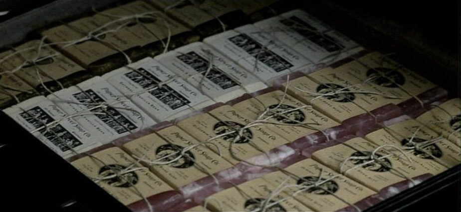

# Marseille



```
- .... .
..-. .. --.- ... -
--.- ..- .-.. .
--- ..-.
- .... .
..-. .. ..- .... -
-.-. .-.. ..- .---
.. ...
```

Marseille is a plaintext-to-morse-code encoding library and command-line
tool.

Well, the CLI is really named `morsel`, primarily because it rhymes, OF COURSE.

> Don't worry if you don't get do yourself a favor and find a restaurant
> that serves morsel mushrooms and feel a true delight.


## Installing

```bash
make release
```

## Usage

### command-line

```bash
morsel string
```


### Rust

```rust
use marseille::modulate;

const SS: &str = " ";
pub fn main() {
    let erst = "The first rule of the Fight Club is you do not talk about it";
    let stanza: String = String::from(erst);
    println!("{}", modulate(stanza, &SS))
}
```


## Decoding

...TK
